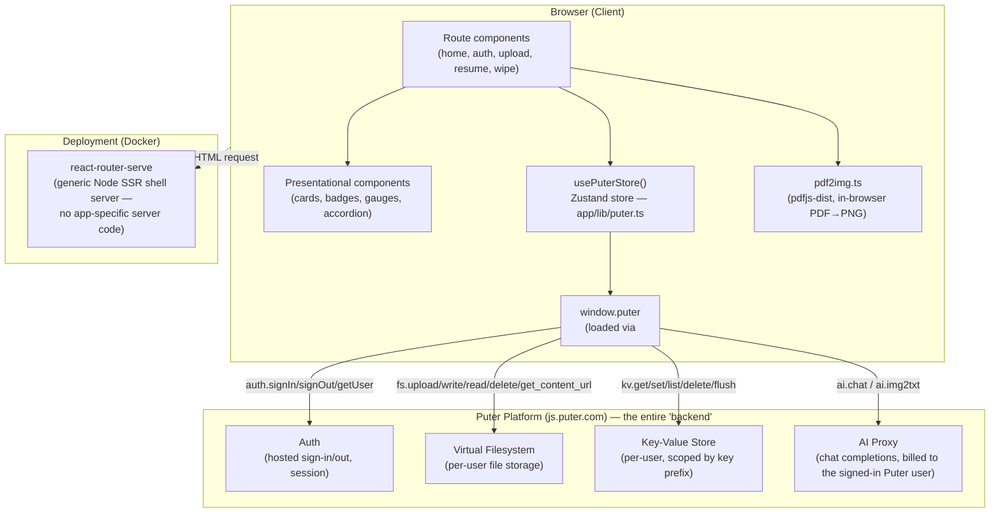
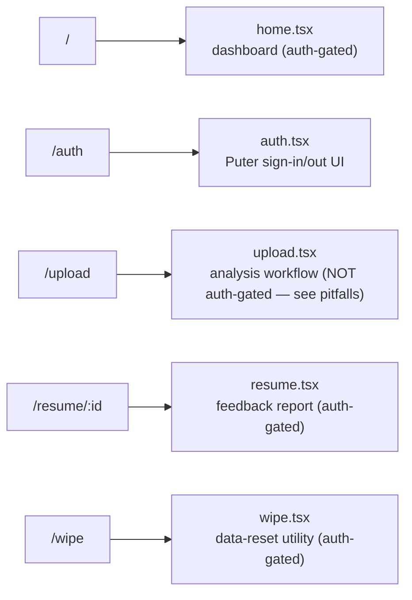
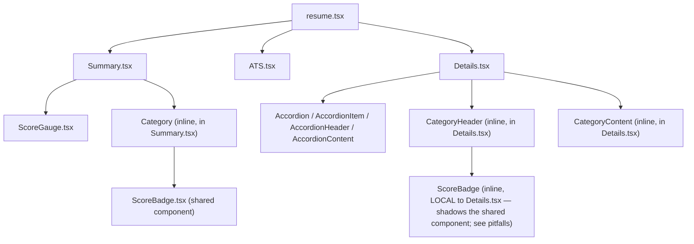
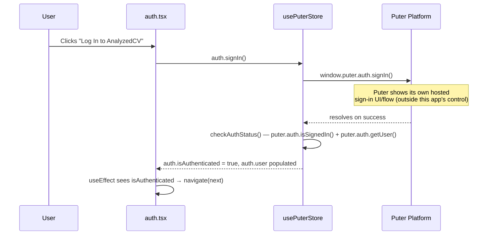
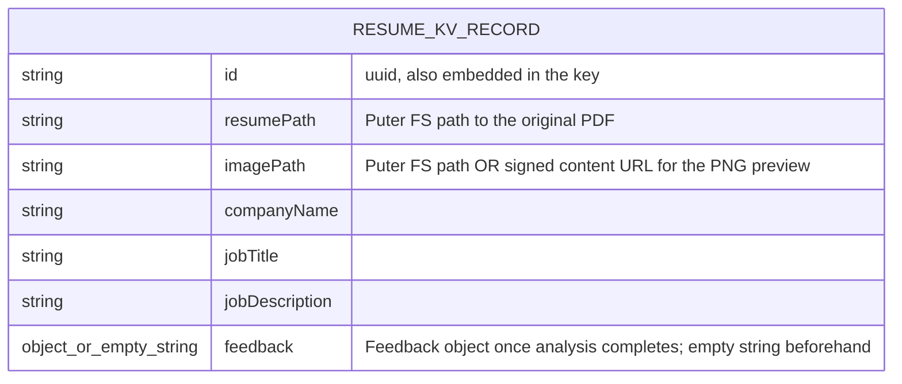
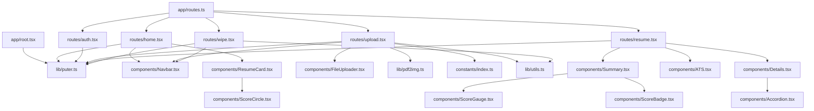

# DEVELOPER.md — AnalyzedCV Technical Handbook

> Written for the returning maintainer. Read this before touching the code. It explains the *why*, not just the *what*.
>
> A defining architectural fact about this project, worth internalizing before anything else: AnalyzedCV has **no backend it owns at all**. There is no hand-written Express/Mongo (or any other) server here — every "server-side" concern (auth, file storage, a database, and AI inference) is delegated to a third-party platform called **Puter**, accessed entirely from the browser.

---

## 1. Project Overview

**AnalyzedCV** is a single-purpose diagnostic tool: a user uploads a resume PDF plus a target job's title/description, and an LLM (invoked via Puter's AI proxy) scores the resume against that job and returns structured, categorized feedback (ATS compatibility, tone & style, content, structure, skills), which is then rendered as a visual report.

**Primary purpose:** answer "how well does my resume match this specific job, and what exactly should I fix?" — a narrow, analysis-only tool, not a resume builder or editor.

**Major capabilities:**
- Sign in via Puter's own hosted authentication (no app-specific account system).
- Upload a PDF resume + paste a job title/description.
- Client-side PDF → PNG conversion (for a fast visual preview) using `pdf.js`.
- AI-driven analysis producing a structured JSON feedback object (overall score + five sub-scores, each with actionable tips).
- A dashboard listing all previously analyzed resumes for the signed-in user, each showing an at-a-glance score.
- A detail page rendering the full feedback report next to the original resume preview.
- A "wipe" utility page to delete all of a user's stored files and key-value data in one action.

**Overall architecture:** a **Backend-as-a-Service (BaaS) single-page application**. There is no custom REST API, no database the developer manages, and no server-side business logic beyond serving the compiled app shell. All persistence, identity, and AI inference are provided by **Puter** (`js.puter.com`), loaded as a global `window.puter` object via a `<script>` tag, and wrapped in a single Zustand store (`app/lib/puter.ts`) that is the *only* interface the rest of the app uses to talk to the outside world.

**Technologies used:** React Router v7 (in framework/SSR mode) + Vite, TypeScript throughout, Tailwind CSS v4, Zustand for the one global store, `pdfjs-dist` for client-side PDF rendering, `react-dropzone` for the upload UI. Deployed as a Docker container running `react-router-serve` (a generic Node SSR server with zero app-specific server code).

**High-level design philosophy:** push every stateful concern (auth, storage, compute) onto a managed platform so the codebase itself only has to be a UI. This trades operational simplicity (no servers, no database ops, no API-key management for the AI provider) for a hard dependency on one third-party platform's availability, data model, and pricing — see [§13](#13-external-services) and [§19](#19-important-design-decisions).

---

## 2. Repository Structure

```
AnalyzedCV-main/
├── Dockerfile                 # Multi-stage build → runs `react-router-serve` (SSR shell server only)
├── react-router.config.ts      # ssr: true — framework-mode SSR is enabled
├── vite.config.ts               # Vite + React Router + Tailwind plugins
├── public/                       # Static assets served as-is (icons, gifs, pdf.js worker)
├── types/                         # Global ambient TypeScript declarations (no imports needed)
└── app/
    ├── root.tsx                    # App shell: <html>, global <script> tag for Puter SDK, error boundary
    ├── routes.ts                    # Route table (React Router v7 config-based routing)
    ├── app.css                       # Tailwind v4 theme tokens + the "Quartz" component classes
    ├── routes/                        # One file per URL (page-level components)
    ├── components/                     # Reusable, mostly presentational UI pieces
    ├── lib/                              # Framework-agnostic logic: the Puter store, PDF conversion, small utils
    └── constants/                        # Static config: the AI prompt template + its expected JSON schema
```

### `types/`
**Why it exists:** Holds *global ambient* TypeScript interfaces (`Resume`, `Feedback`, `FSItem`, `PuterUser`, `KVItem`, `AIResponse`, etc.) — declared with no `export`/`import`, so they're available everywhere without an import statement (standard `.d.ts` global-scope behavior). **What belongs here:** shape definitions for data crossing the Puter boundary or representing the app's core domain object (a `Resume` record). **What should never belong here:** component prop types or anything with implementation logic — this folder is types-only.

### `app/lib/`
**Why it exists:** The "no backend" architecture still needs *some* place for non-UI logic. This folder holds exactly three concerns:
- `puter.ts` — the single Zustand store wrapping the entire `window.puter` SDK (see [§3](#3-architecture-overview) and [§13](#13-external-services)). This is the most important file in the repository.
- `pdf2img.ts` — client-side PDF-to-PNG rendering via `pdfjs-dist`, used to generate a fast visual preview without needing a server-side rendering step.
- `utils.ts` — tiny, pure helpers (`cn` for Tailwind class merging, `formatSize`, `generateUUID`).
**What should never belong here:** React components or route-specific logic.

### `app/constants/`
**Why it exists:** Centralizes the AI prompt engineering in one place — `AIResponseFormat` (the JSON schema the model must follow) and `prepareInstructions()` (the full system/task prompt builder). **Why kept separate from the route that uses it (`upload.tsx`):** so prompt tuning doesn't require touching upload-flow logic, and so the expected response shape lives next to the prompt that produces it. Also contains a `resumes` dummy dataset — **currently unused dead code** (see [§24 Technical Debt](#24-technical-debt)), left over from an earlier static/demo version of the dashboard.

### `app/components/`
**Why it exists:** Reusable UI. Split by responsibility:
- `Navbar.tsx`, `FileUploader.tsx` — general-purpose, used across multiple routes.
- `ResumeCard.tsx`, `ScoreCircle.tsx` — the dashboard's per-resume summary tile.
- `Summary.tsx`, `ATS.tsx`, `Details.tsx`, `ScoreBadge.tsx`, `ScoreGauge.tsx`, `Accordion.tsx` — the resume-detail report, decomposed by feedback category. `Accordion.tsx` is a small, generic, self-contained compound-component (context-based) used only by `Details.tsx` to make the four non-ATS categories collapsible.
**What should never belong here:** direct calls to `window.puter` — components receive already-fetched data as props from their parent route; only `routes/*.tsx` files call into the Puter store.

### `app/routes/`
**Why it exists:** One file per URL, matching `routes.ts`. Each route file owns: reading `usePuterStore()`, orchestrating one or more Puter calls, holding page-local state, and composing components to render the result. This is where *all* data-fetching and mutation in the app happens — see [§6](#6-frontend-flow).

### `public/`
**Why it exists:** Assets that must be served at a fixed, predictable URL path rather than bundled/hashed by Vite — notably `pdf.worker.min.mjs` (the PDF.js web worker, which must be fetched by absolute path at runtime, not imported) and the loading GIFs shown during long-running operations (upload/analysis, resume listing).

---

## 3. Architecture Overview



**Major layers:**
1. **Route components** — the only layer permitted to call `usePuterStore()`; equivalent to "controllers" in a traditional app, except they talk directly to a third-party SDK instead of a self-hosted API.
2. **The Puter store (`lib/puter.ts`)** — a thin, uniform wrapper around every `window.puter.*` call, adding: a `null`-check for SDK availability, consistent error capture into a single `error` state field, and a stable function reference so components don't need to guard against `window.puter` being undefined during SSR.
3. **`window.puter` (external, injected via `<script>`)** — the actual implementation of auth, filesystem, key-value store, and AI. The app has zero code for any of these — it only calls this object's methods.
4. **Presentational components** — pure rendering, given data as props; never call `usePuterStore()` directly.

**Separation of concerns:** the "database" (Puter KV) only ever stores JSON blobs under `resume:<uuid>` keys — there's no schema enforced by Puter itself; the `Resume`/`Feedback` TypeScript interfaces in `types/index.d.ts` are the *only* place the shape is enforced, and only at compile time (nothing prevents a stored blob from drifting out of shape at runtime — see [§8](#8-database-documentation)).

**Dependency direction:** `routes → components` and `routes → lib/puter.ts`. `components` never import from `routes`. `lib/puter.ts` never imports from `components` or `routes`. This is a strict one-directional discipline, with `lib/puter.ts` standing in for what would otherwise be a REST API client.

**Important abstraction — why everything goes through one Zustand store:** `window.puter` isn't guaranteed to exist yet when a component first renders (the script tag loads asynchronously, and during SSR it never exists at all). `init()` polls for `window.puter` every 100ms (giving up after 10 seconds with an error) so that every route can simply read `puterReady`/`isLoading` from the store instead of each independently re-implementing "wait for the SDK" logic.

---

## 4. Execution Flow

### Framework/server startup
This is a React Router v7 app in **framework mode with SSR enabled** (`ssr: true` in `react-router.config.ts`). In development, `npm run dev` starts the Vite dev server with the React Router plugin, which handles both SSR and HMR. In production (per the `Dockerfile`), `npm run build` produces a `build/` directory, and `npm run start` runs `react-router-serve ./build/server/index.js` — a generic Node server with **no custom server code written for this project**. It renders route components to HTML on first request and hydrates them in the browser; it has no knowledge of Puter, auth, or any business logic.

**Why SSR matters here despite there being no server-side data:** the initial HTML (nav bars, page headings, static copy) is rendered server-side for fast first paint and basic SEO via each route's `meta()` export. But **all actual data — auth state, resumes, feedback — is fetched client-side only**, after hydration, because `window.puter` does not exist during SSR. This is why every route follows a "loading" pattern (`isLoading` flags, GIF placeholders) rather than using React Router's server-side `loader` functions — there is no server-side data source to load from.

### App shell startup (`app/root.tsx`)
1. The `<head>` includes `<script src="https://js.puter.com/v2/">` — this is what eventually defines `window.puter`. It loads asynchronously and is not guaranteed ready when React first renders.
2. The `Layout` component (React Router's root layout, wrapping every route) calls `usePuterStore().init()` in a `useEffect` on mount — this is the **single entry point** that kicks off the "wait for Puter, then check auth status" sequence described in [§3](#3-architecture-overview). Every route in the app implicitly depends on this having run, since `Layout` wraps all of them.

### Per-route startup pattern
Every protected route (`home.tsx`, `resume.tsx`, `wipe.tsx`) repeats the same two-`useEffect` convention:
```ts
useEffect(() => {
  if (!isLoading && !auth.isAuthenticated) navigate(`/auth?next=${currentPath}`);
}, [isLoading, auth.isAuthenticated]);

useEffect(() => {
  // fetch this page's data from kv/fs once auth/store is ready
}, []);
```
**Note:** `upload.tsx` is the one route that does **not** follow this pattern — see [§23 Common Pitfalls](#23-common-pitfalls).

---

## 5. Request Lifecycle

There is no server-side request lifecycle to trace in the traditional sense (no Express, no middleware chain, no database query pipeline on a server the developer controls). The equivalent lifecycle is **client-side, per Puter SDK call**:

```
User action (e.g. clicks "Analyze Resume")
    ↓
Route component's handler (e.g. handleAnalyze in upload.tsx)
    ↓
usePuterStore() action (e.g. fs.upload, ai.feedback, kv.set)
    ↓
Internal null-check: is window.puter defined?
    ├─ No  → setError("Puter.js not available"), return early
    ↓ Yes
Call the underlying window.puter.* method
    ↓
Puter Cloud Platform (auth/session validation happens implicitly on their side)
    ↓
Response (file metadata / KV boolean / AI completion object)
    ↓
Route component updates local React state (setResumes, setFeedback, etc.)
    ↓
Re-render
```

**Worked example: the full "Analyze Resume" flow (`upload.tsx`'s `handleAnalyze`)** — the most complex operation in the app, chaining five sequential Puter calls:
1. `fs.upload([file])` — uploads the raw PDF to the user's Puter-managed storage. Returns a path.
2. `convertPdfToImage(file)` — **runs entirely client-side** (no Puter call): loads `pdfjs-dist`, renders page 1 to a `<canvas>` at 4x scale, exports a PNG `File`.
3. `fs.upload([imageFile])` — uploads that PNG to Puter storage. Returns another path.
4. `fs.getContentUrl(uploadedImage.path)` — asks Puter for a signed/public URL for the image (used so the resume-list dashboard can `` it directly without an authenticated fetch).
5. `kv.set('resume:<uuid>', JSON.stringify({...}))` — writes an initial record (with `feedback: ""`) **before** the AI call, so a resume entry exists even if analysis fails or is slow.
6. `ai.feedback(uploadedFile.path, prompt)` — sends the *already-uploaded PDF* (by Puter path, not re-uploading bytes) plus the prompt built from `prepareInstructions()` to Puter's AI proxy, requesting `gpt-4o`.
7. The raw text response is defensively parsed (`extractJSON`) to strip any markdown code fences the model might still emit despite the prompt explicitly forbidding them, then `JSON.parse`d.
8. `kv.set('resume:<uuid>', ...)` again — **overwrites** the same key with the now-complete record including `feedback`.
9. `navigate('/resume/<uuid>')`.

**No authentication check gates any of this** (see [§23](#23-common-pitfalls)) — if Puter itself is not signed in, individual calls (`fs.upload`, `kv.set`) will presumably fail or trigger Puter's own auth prompt, rather than the app redirecting cleanly beforehand.

---

## 6. Frontend Flow

### Routing (`app/routes.ts`)


**Auth gating pattern:** protected routes **redirect** via `navigate('/auth?next=<original path>')` rather than rendering an inline login form in place. The `auth.tsx` page reads the `next` query param and, once `auth.isAuthenticated` becomes true (i.e., right after a successful Puter sign-in), navigates back to it. This round-trip is why every protected route must pass its own path as `next` when redirecting to `/auth`.

**Rendering:** SSR shell + client hydration (see [§4](#4-execution-flow)). No route uses React Router's `loader`/`action` data APIs — everything is fetched in `useEffect` after mount, because the data source (`window.puter`) is browser-only.

**State management:**
- **Global (Zustand):** the entire `usePuterStore` — auth state, loading/error flags, and every wrapped Puter method. There is exactly one store, and it doubles as both "state container" and "API client" — a single object plays the role that a separate state-management library plus a separate HTTP client would normally split across two layers.
- **Local (`useState`):** all page-specific data — `resumes` array in `home.tsx`, the in-progress `feedback`/`imageUrl`/`resumeUrl` in `resume.tsx`, the multi-step `statusText`/`isProcessing` in `upload.tsx`, the file list in `wipe.tsx`.
- **No caching layer.** Every route re-fetches on mount rather than caching query results across navigations.

**API communication:** exclusively through `usePuterStore()`'s wrapped methods — there is no Axios, no `fetch()` call to an app-owned endpoint anywhere in the codebase (Puter's SDK handles its own network transport internally, invisible to app code).

**Component hierarchy for the report view (`resume.tsx`):**

`resume.tsx` fetches the KV record once, then hands the whole `feedback` object down to three sibling components (`Summary`, `ATS`, `Details`), each responsible for a different slice of it — `Summary` shows the overview + four category scores, `ATS` gets special standalone treatment (its own card, since ATS compatibility is the headline metric), and `Details` renders the same four non-ATS categories again, this time with full accordion-collapsed explanations.

---

## 7. Authentication & Authorization

**Mechanism:** entirely delegated to Puter's hosted authentication. There is no JWT, no session cookie the app manages, no password ever touched by this codebase.



**Session persistence:** entirely Puter's responsibility — the app never reads or writes any auth token itself. `checkAuthStatus()` is re-run on every full app load (via `init()` in `root.tsx`'s `Layout`), functioning as a "validate the session on app mount" step, except it asks Puter directly rather than calling an app-owned `/me`-style endpoint.

**Authorization model:** implicit and platform-enforced. Because `fs` and `kv` operations are scoped to *whichever Puter user is currently signed in* (this is a property of the Puter platform itself, not something this codebase implements), a signed-in user can only ever see their own files and KV keys — there is no `userId` filtering anywhere in this codebase because there doesn't need to be; Puter's own account boundary *is* the authorization boundary, in contrast to a self-hosted backend where every query would need to manually filter by a user ID.

**Sign out:** `auth.signOut()` calls `puter.auth.signOut()` and clears local store state. No app-side cleanup (e.g., clearing cached KV data) is needed since nothing is cached outside of in-memory React state, which is naturally discarded on navigation/reload.

**No role system, no permissions:** every signed-in user has full access to their own data and nothing else.

---

## 8. Database Documentation

**There is no database in the traditional sense.** The system of record is **Puter's Key-Value store**, a simple string-keyed, string-valued store scoped per-user by the platform. This app layers a lightweight convention on top of it:

- **Key pattern:** `resume:<uuid>` — one key per analyzed resume.
- **Value:** a `JSON.stringify`-encoded blob matching (in intent, not in enforced schema) this shape:



**Why KV instead of a "real" database:** there is no relational structure to model — each resume is a single, self-contained JSON document, never joined against other resumes or users (a listing query is just "list every key matching `resume:*` for this user," which Puter's `kv.list(pattern, true)` supports natively). This is the natural conclusion of an "embed everything into one document" design taken as far as it can go — there isn't even a separate `User` record, since Puter *is* the user directory.

**No schema enforcement at the storage layer.** The `Resume`/`Feedback` TypeScript interfaces in `types/index.d.ts` describe the *intended* shape, but:
- `home.tsx` casts `JSON.parse(resume.value) as Resume` — a compile-time-only assertion; a malformed or partially-written record (e.g., one where the AI call failed and `feedback` is still `""`) will pass this cast and only fail later when a component tries to read `feedback.overallScore`.
- `upload.tsx`'s `data` variable is typed `any`, meaning the object written to KV isn't even checked against the `Resume` interface at the write site.

**Two-phase write pattern:** `upload.tsx` writes the KV record **twice** — once immediately after upload (with `feedback: ""`), and again after the AI call resolves (with the real `feedback` object). This means a resume can exist in a "processing" (or permanently-failed, if the AI call throws) state where `feedback` is still the empty string — `resume.tsx` and `home.tsx`/`ResumeCard.tsx` do not explicitly handle this partial state (see [§23 Common Pitfalls](#23-common-pitfalls)).

**File storage:** the original PDF and the generated preview PNG live in **Puter's virtual filesystem** (`fs.upload`), referenced from the KV record only by path/URL — binary data is never stored in the KV value itself, following the standard "store the URL, not the bytes" pattern for keeping a small metadata store decoupled from large binary assets.

**Migrations:** not applicable — there is no schema to migrate. If the `Resume`/`Feedback` shape changes, old KV records simply won't match the new interface at runtime, with no automated backfill mechanism.

---

## 9. API Documentation

There is no REST/GraphQL API surface owned by this project — "endpoints" here means **the Puter SDK methods this app actually calls**, each of which is a network call to Puter's platform, wrapped by `usePuterStore()`.

### `auth.signIn()` / `auth.signOut()` / `auth.isSignedIn()` / `auth.getUser()`
- **Purpose:** the entirety of authentication.
- **Called from:** `lib/puter.ts` internally (`checkAuthStatus`, `signIn`, `signOut`, `refreshUser`); triggered by `auth.tsx`'s button and `root.tsx`'s startup `init()`.
- **Side effects:** none the app is responsible for — Puter manages the session.

### `fs.upload(files: File[] | Blob[])`
- **Purpose:** store a binary file (original PDF, generated preview PNG) in the user's Puter storage.
- **Called from:** `upload.tsx`, twice per analysis (once for the PDF, once for the PNG).
- **Returns:** an `FSItem`-like object including a `.path`, later used both to `fs.read()` the file back and as the `puter_path` sent to the AI feedback call.

### `fs.get_content_url(path)` (exposed as `getContentUrl`)
- **Purpose:** obtain a URL suitable for direct `` use for a stored file, without needing an authenticated fetch.
- **Called from:** `upload.tsx`, immediately after uploading the preview image — the resulting URL (or, if it fails, the raw internal path as a fallback) is what gets stored as `imagePath` in the KV record.
- **Failure behavior:** wrapped in its own `try/catch` inside `lib/puter.ts`; on failure, logs to console and returns `null` — `upload.tsx` falls back to storing `uploadedImage.path` instead, which may not be a directly renderable URL (see [§23](#23-common-pitfalls)).

### `fs.read(path)`
- **Purpose:** fetch a previously stored file's bytes back as a `Blob`.
- **Called from:** `resume.tsx`, to re-hydrate both the original PDF (rebuilt as a `Blob` with `type: "application/pdf"` so the browser can open it in a new tab) and the preview image (turned into an object URL for ``).

### `fs.readdir(path)` (exposed as `readDir`) / `fs.delete(path)`
- **Purpose:** list all files and delete them one by one.
- **Called from:** `wipe.tsx` only — lists everything in the user's root (`"./"`) and, on confirmation, deletes every listed file in parallel via `Promise.all`.

### `kv.get(key)` / `kv.set(key, value)` / `kv.list(pattern, returnValues)` / `kv.flush()`
- **Purpose:** the entire "database" interface (see [§8](#8-database-documentation)).
- **Called from:** `home.tsx` (`list("resume:*", true)` to populate the dashboard), `resume.tsx` (`get("resume:<id>")`), `upload.tsx` (`set` twice per analysis), `wipe.tsx` (`flush()` to clear all KV data for the user in one call).

### `ai.chat(...)` (exposed as `chat`, currently unused by any route) and `ai.feedback(path, message)`
- **`feedback` purpose:** the core AI call — sends a **file reference** (not re-uploaded bytes; Puter resolves the already-stored `puter_path`) plus a text instruction to Puter's AI proxy, hardcoded to request the `gpt-4o` model (a comment in the source notes this was previously `claude-3-7-sonnet`, suggesting the model choice has been tuned/changed before).
- **Called from:** `upload.tsx`, as the sixth step of the analysis flow.
- **Request shape:** a single-message chat array with a `content` array containing a `{ type: "file", puter_path }` block and a `{ type: "text", text: <prompt> }` block — this "attach a file by reference, then ask about it" pattern is how the AI reads the actual resume content without the app needing its own PDF-text-extraction step.
- **Response handling:** the raw `AIResponse.message.content` may be either a plain string or an array with a `.text` field (an artifact of different underlying model providers returning slightly different shapes through Puter's proxy) — `upload.tsx` handles both.

### `ai.img2txt(image, testMode)`
- **Purpose:** image-to-text OCR, exposed on the store but **not currently called from any route** — dead capability, possibly reserved for a future feature (e.g., re-extracting text if the PDF-attachment approach fails for scanned/image-based resumes).

---

## 10. Business Logic

**Core "service" (there is only one, and it lives entirely in `upload.tsx`):** the resume analysis pipeline described step-by-step in [§5](#5-request-lifecycle). This single `handleAnalyze` function is the most business-logic-dense piece of code in the entire project — everything else is either pure display or simple CRUD-via-KV.

**Key assumptions:**
- Exactly one resume PDF is analyzed against exactly one job posting at a time — there's no batch/multi-job comparison feature.
- Only the **first page** of a multi-page PDF is rendered for the visual preview (`pdf2img.ts` calls `pdf.getPage(1)` unconditionally) — a two-page resume's second page is never shown in the preview, though the *full* PDF (all pages) is still what's sent to the AI via the file-reference attachment, since that's the original uploaded file, not the single-page render.
- The AI is explicitly instructed to be harsh ("Act as a cynical, high-level technical recruiter... DO NOT be nice... give it a failing score (below 50)" — see `constants/index.ts`) — this is a deliberate product decision to make feedback feel credible/actionable rather than uniformly encouraging.
- `extractJSON`'s regex-based markdown-fence stripping exists specifically because LLMs are known to sometimes ignore "don't wrap in code fences" instructions — this is defensive parsing layered on top of explicit prompt engineering, not a substitute for it.

**Important algorithm — `extractJSON` (`upload.tsx`):** tries, in order: (1) a fenced ` ```json ... ``` ` block, (2) any fenced ` ``` ... ``` ` block, (3) falls back to the raw text; then locates the first `{` and last `}` in whatever text remains and parses that substring. This is a pragmatic, non-strict JSON extraction strategy tolerant of minor formatting deviations from the model, at the cost of potentially grabbing malformed JSON if the surrounding text itself contains stray braces.

---

## 11. Data Flow

**Example: uploading and analyzing a resume (see [§5](#5-request-lifecycle) for the full call sequence). Key transformation points:**

```
User's PDF File (browser File object)
    ↓ fs.upload
Puter-hosted binary (referenced by "path" string from here on)
    ↓ pdf2img.ts (client-side canvas render, first page only, 4x scale)
PNG File (new browser File object, unrelated to the PDF's Puter path)
    ↓ fs.upload
Puter-hosted PNG (its own "path")
    ↓ fs.get_content_url
Signed/public URL string (or a fallback raw path if this call fails)
    ↓ kv.set (write #1 — feedback: "")
JSON string stored under `resume:<uuid>`
    ↓ ai.feedback(pdfPath, prompt) — Puter reads the PDF server-side, not the app
Raw LLM text response (possibly markdown-fenced)
    ↓ extractJSON + JSON.parse
Feedback object (matching, but not verified against, the Feedback interface)
    ↓ kv.set (write #2 — full record now includes feedback)
Final JSON string stored under the same key
    ↓ navigate to /resume/:id
resume.tsx: kv.get → JSON.parse → fs.read (both PDF and image) → Blob → Object URL
    ↓
Rendered report (Summary, ATS, Details) + rendered preview (, linked to a new-tab PDF view)
```

**Notable transformation:** the resume's *text content* is never extracted or transformed by this app's own code at any point — there is no client-side PDF-text-extraction library anywhere in this codebase. The actual reading of the PDF's content happens entirely inside Puter's AI proxy, which receives a file reference and (presumably) extracts/interprets it server-side on Puter's infrastructure. This app only ever handles the PDF as opaque binary data (for upload/storage) or as a rendered image (for the preview).

---

## 12. State Management

**Frontend:**
- **Global (Zustand, `usePuterStore`):** `isLoading`, `error`, `puterReady`, `auth.{user, isAuthenticated}`, plus every wrapped Puter method. This single store plays the role that a separate global-state library plus a separate HTTP client would normally split across two layers — here, "the API client" and "the global state container" are the same object.
- **Local (`useState`), per route:** `home.tsx` holds the fetched `resumes` list; `upload.tsx` holds the in-progress `file`, `isProcessing`, `statusText`; `resume.tsx` holds `imageUrl`, `resumeUrl`, `feedback`; `wipe.tsx` holds the file listing and wipe-in-progress flag.
- **No persistent client-side cache and no `localStorage` usage anywhere in this codebase** for auth — session persistence is entirely Puter's internal responsibility (mechanism not visible to/controlled by this app).

**Backend:** not applicable — there is no server-side state beyond what Puter manages on the app's behalf, invisible to this codebase.

**Persistent storage:** Puter's KV store (structured-ish JSON blobs) and Puter's filesystem (binary PDFs/PNGs) — both external, both fully described in [§8](#8-database-documentation) and [§9](#9-api-documentation).

---

## 13. External Services

| Service | Purpose | Integration point | Notes |
|---|---|---|---|
| **Puter** (`js.puter.com`) | **The entire backend**: authentication, file storage, key-value database, and AI inference | `app/root.tsx` (script tag), `app/lib/puter.ts` (all usage) | This is the single most important architectural fact about this project. There is no `.env` file, no API keys held by this app for any of these four concerns — the developer never provisions a database, an object store, or an OpenAI account. Puter's own "User Pays" model means AI inference cost is billed to whichever Puter account is signed in, not to the app's operator. |
| **pdf.js (`pdfjs-dist`)** | Client-side PDF rendering (page 1 → canvas → PNG) | `app/lib/pdf2img.ts` | Runs entirely in-browser; its worker script (`pdf.worker.min.mjs`) is served as a static file from `public/`, not bundled, because PDF.js loads its worker via a runtime URL rather than an import. |
| **Google Fonts** | Loads the "Mona Sans" / "Inter" typefaces | `<link>` tags in `app/root.tsx`, `@import` in `app.css` | Purely presentational; no functional dependency. |

**No conventional database, no self-hosted file storage, no directly-held AI provider credentials, no email provider, no payment provider, no queue.** This table is intentionally short — that shortness *is* the architecture.

---

## 14. Environment Variables

**There are none.** No `.env`, `.env.sample`, or `process.env`/`import.meta.env` reference exists anywhere in the application source (`vite.config.ts`'s dev-only `.well-known` proxy workaround is the only environment-adjacent config, and it's hardcoded, not variable-driven). This follows directly from the architecture: with no self-hosted database, no self-managed AI provider key, and no app-issued auth secret, there is nothing left that would traditionally need to live in an environment variable. `.gitignore` still lists `.env` defensively, but as of this codebase, nothing produces or consumes one.

---

## 15. Error Handling

**Puter store layer (`lib/puter.ts`):** every wrapped method follows the same shape — check `getPuter()` is non-null (else `setError("Puter.js not available")` and return early), then `try/catch` around the underlying call, funneling any thrown error's `.message` into the single shared `error` state field via `setError`. This means the entire app has exactly **one** error channel for all Puter-related failures, regardless of whether the failure was "SDK not loaded," "not signed in," "file not found," or "AI request failed" — components that want to surface a specific error must read `usePuterStore().error` generically.

**Route-level error handling:** inconsistent across routes:
- `upload.tsx` has its own **local** try/catch around the entire `handleAnalyze` flow, setting `statusText` to `Error: ${err.message}` and re-enabling the form — this duplicates, rather than reads, the store's `error` state.
- `resume.tsx` and `home.tsx` have **no catch blocks at all** around their data-loading `useEffect`s — an unhandled rejection from `kv.get`/`fs.read`/`kv.list` will leave the page in its default "still loading" visual state (the analyzing/scanning GIF) indefinitely rather than showing an error message, since the underlying store methods already swallow the error into `setError` and return `undefined`, and the route code doesn't check for that `undefined` explicitly in most branches.
- `wipe.tsx` wraps its delete operation in try/catch, logging failures to console without surfacing them to the user beyond the button returning to its normal state.

**No global error boundary for data failures** — `root.tsx`'s `ErrorBoundary` only catches React Router routing/rendering errors (404s, thrown render errors), not async Puter-call failures, which are handled (or silently swallowed) locally per the patterns above.

**Retries:** none, anywhere — a transient Puter/network failure during the multi-step `handleAnalyze` sequence requires the user to restart the entire upload from scratch.

**Monitoring/logging:** `console.error` only, at a handful of call sites (`getContentUrl` failures, `wipe.tsx`'s delete failures, `pdf2img.ts` conversion failures, `upload.tsx`'s top-level catch). No structured logging or external error tracking.

> **Note:** this section is purely about software error-handling architecture and does not touch personal well-being topics.

---

## 16. Security

**Authentication & authorization:** entirely delegated to Puter — see [§7](#7-authentication--authorization). This app has no attack surface here beyond correctly checking `auth.isAuthenticated` before rendering sensitive UI, which it does inconsistently (see [§23 Common Pitfalls](#23-common-pitfalls) — `upload.tsx` doesn't check at all).

**No secrets to leak.** With no `.env`, no API keys, and no self-issued tokens, there is no credential-leakage surface to manage at all (no JWT secret, DB URI, or AI provider key held by this app anywhere). The entire "secret" boundary is Puter's own session, which this app never reads or stores directly (no token in `localStorage`).

**Input validation:** minimal — `FileUploader.tsx` restricts uploads to `application/pdf` with a 20MB cap via `react-dropzone`'s `accept`/`maxSize` options (client-side only; nothing re-validates file type/size after upload, since there's no server code to do so). The job title/company/description text fields are unvalidated free text, sent as-is into the AI prompt.

**Prompt injection surface:** `jobDescription` (arbitrary pasted text) is interpolated directly into the LLM prompt in `prepareInstructions()`. A user could paste adversarial text designed to override the "be cynical, output only JSON" instructions — the impact is limited to that user seeing a manipulated *analysis of their own resume*, not any cross-user data exposure, since there's no shared state the injected prompt could reach.

**XSS:** React's default escaping covers all rendered feedback text (tips, explanations, company/job names) — no `dangerouslySetInnerHTML` appears anywhere in the codebase.

**CORS/CSRF:** not applicable in the traditional sense — this app makes no same-origin API calls of its own; all "backend" calls go through the Puter SDK to Puter's own domain, and Puter is responsible for its own cross-origin security posture.

**Data exposure via signed URLs:** `fs.get_content_url()` produces a URL used directly as an `` — the app does not control this URL's expiry or access scope; that's entirely Puter's mechanism. If Puter's signed URLs are long-lived or guessable, that would be a Puter-platform-level concern, outside this codebase's control.

---

## 17. Performance Considerations

**No pagination.** `home.tsx` fetches every KV key matching `resume:*` in one call and renders all of them — fine at small scale, but worth revisiting if a single user's resume count grows large.

**No caching.** Every route re-fetches from Puter on mount; navigating away and back always re-triggers `fs.read`/`kv.get` calls.

**The analysis pipeline is fully sequential, not parallelized**, despite two of its steps being independent: uploading the original PDF (step 1) and generating+uploading the preview image (steps 2–3) do not depend on each other and could in principle run concurrently (e.g., via `Promise.all`), but `handleAnalyze` awaits each step strictly in order. For a typical resume this is a minor, not severe, latency cost, but it's the first thing to optimize if upload feels slow.

**Client-side PDF rendering at 4x scale** (`pdf2img.ts`) produces a large, high-fidelity canvas purely for a thumbnail-sized preview — a reasonable trade-off for print/zoom quality on the resume-detail page, but it does mean larger memory/CPU use during conversion than a lower scale would need, especially on mobile devices.

**The AI call is the long pole** in the entire flow — no timeout override, streaming, or background-job pattern; the user simply waits, with `statusText` updates as the only feedback.

**No code-splitting** is configured beyond whatever React Router v7's default route-based splitting provides out of the box; no explicit `lazy()` usage is present in the route table.

---

## 18. Dependency Graph



**Tightly coupled:** `upload.tsx` is coupled to `constants/index.ts`'s `AIResponseFormat` string in a real drift-risk way — the `Feedback` TypeScript interface, the `AIResponseFormat` prompt string, and the actual rendering logic in `Summary`/`ATS`/`Details` are three independent, manually-synchronized representations of the same shape.

**Isolated/low-coupling modules:** `lib/utils.ts` (pure functions, zero app dependencies), `components/Accordion.tsx` (a fully generic, reusable compound component with no domain knowledge), `lib/pdf2img.ts` (only depends on the browser Canvas API and `pdfjs-dist`).

**Notable coupling curiosity:** `components/ScoreBadge.tsx` (exported, shared) and an unrelated, identically-named local component defined inside `Details.tsx` are structurally similar but not the same component — see [§23 Common Pitfalls](#23-common-pitfalls).

---

## 19. Important Design Decisions

- **Delegating auth, storage, database, and AI entirely to Puter, rather than building a custom backend.** *Inferred; high confidence.* This is the single defining decision of the project. It eliminates an enormous amount of code (no Express app, no Mongoose models, no JWT logic, no ImageKit/S3 integration, no self-managed OpenAI key) at the cost of a hard, all-or-nothing dependency on one third-party platform's uptime, pricing model, data portability, and API stability. It also shifts AI inference cost to the *end user's own Puter account* rather than the app operator — a distinctive cost/business model where the operator never needs to fund an AI provider key themselves.
- **Sending the AI a file reference (`puter_path`) rather than extracting text client-side first.** *Inferred; medium-high confidence.* This simplifies the client (no PDF-text-extraction library needed for the *analysis* path — `pdfjs-dist` is only used for the *visual preview*, a different purpose) and likely produces better-quality extraction since Puter's AI proxy can presumably read the PDF natively rather than relying on a potentially lossy client-side text-extraction library. The trade-off is an implicit dependency on Puter's file-attachment AI feature continuing to support this content type/pattern.
- **Writing the KV record twice (before and after the AI call) rather than once at the end.** *Inferred; high confidence.* Ensures a resume entry exists (and is navigable to) even if the AI step is slow or fails outright, rather than losing the uploaded files' association entirely on an AI error. The cost is the partial/`feedback: ""` state described in [§8](#8-database-documentation), which downstream UI doesn't explicitly handle.
- **Actual `navigate()`-based redirect-to-auth, rather than rendering a login form in place.** *Inferred; medium confidence.* This preserves the originally-requested URL via the `next` query param and performs a real navigation once authentication completes — a clean pattern, likely a natural fit given that Puter's `signIn()` opens its own hosted flow rather than this app owning its own login form.
- **Zustand for global state**, rather than a more ceremony-heavy state library. *Inferred; medium confidence.* Its smaller API surface and lack of boilerplate (no slices/reducers/action-creators ceremony) fits a project where the "global state" is really just one cohesive SDK wrapper, not multiple independent domains of state.

---

## 20. Coding Patterns

**Route-level auth-gate pattern (repeated in `home.tsx`, `resume.tsx`, `wipe.tsx`):**
```ts
useEffect(() => {
  if (!isLoading && !auth.isAuthenticated) navigate(`/auth?next=${currentPath}`);
}, [isLoading, auth.isAuthenticated]);
```
Any new protected route should copy this exactly, substituting its own path into `next`. (`upload.tsx` is the sole existing exception — do not copy it; see [§23](#23-common-pitfalls).)

**Puter-store-method pattern (`lib/puter.ts`, repeated for every wrapped call):**
```ts
const someAction = async (...) => {
  const puter = getPuter();
  if (!puter) { setError("Puter.js not available"); return; }
  try {
    return await puter.someNamespace.someMethod(...);
  } catch (err) {
    setError(err instanceof Error ? err.message : "Fallback message");
  }
};
```
Follow this exactly for any new Puter capability the app starts using (e.g., if `ai.img2txt` is ever wired up for real).

**Score-threshold-to-color-band convention**, repeated independently in `ScoreBadge.tsx`, `ATS.tsx`, `Summary.tsx`'s `Category`, and `Details.tsx`'s local `ScoreBadge`: roughly `> 69/70` → emerald ("Strong"/"Great"), `> 39/49` → amber ("Good"/"Needs work at 50 threshold varies slightly), else → rose. **The exact threshold numbers are not perfectly consistent across these four implementations** (some use `> 70`, others `> 69`; some use `> 49`, others `> 39`) — see [§23](#23-common-pitfalls). Any new component needing this banding should pick one canonical set of thresholds rather than adding a fifth slightly-different copy.

**Naming convention:** `PascalCase` components, one per file, matching the export name; route files are lowercase, matching their URL segment (`home.tsx`, `upload.tsx`); `lib/` files are lowercase/camelCase and named after their concern (`puter.ts`, `pdf2img.ts`, `utils.ts`).

---

## 21. Project Conventions for Future Development

- **New Puter capability:** add a wrapped method to `lib/puter.ts` following the established try/catch/`setError` pattern (see [§20](#20-coding-patterns)) and expose it on the store's returned object — never call `window.puter` directly from a route or component.
- **New protected route:** copy the auth-gate `useEffect` pattern from `home.tsx`/`resume.tsx`/`wipe.tsx` (not from `upload.tsx`), add the route to `app/routes.ts`, and add a `meta()` export for consistency with the routes that have one (`home.tsx`, `auth.tsx`).
- **New KV-backed data type:** pick a clear key prefix (mirroring `resume:<uuid>`), define its shape as a global interface in `types/index.d.ts`, and — given the current codebase's gaps here — consider adding a runtime shape check (not just a TypeScript cast) before trusting a value read back from `kv.get`/`kv.list`, since KV values are untyped strings until parsed.
- **New AI-backed feature:** follow the `ai.feedback` pattern in `lib/puter.ts` if the feature needs to reference an already-uploaded file by Puter path; follow the exposed-but-unused `ai.chat`/`ai.img2txt` pattern if it only needs text/image input directly. Keep prompt templates in `app/constants/`, next to their expected response shape, as `prepareInstructions`/`AIResponseFormat` do.
- **New feedback category** (e.g., adding a "Formatting" category alongside ATS/Tone/Content/Structure/Skills): update, together, all of: the `Feedback` interface (`types/index.d.ts`), `AIResponseFormat` and the prompt's category-count expectations (`constants/index.ts`), and the rendering in both `Summary.tsx` (`Category` list) and `Details.tsx` (`categories` array) — these three/four places are not automatically kept in sync (see [§24](#24-technical-debt)).
- **New presentational component:** place it in `components/`; it should accept plain props and never import `usePuterStore` — only route files should touch the store, matching the existing separation.
- **Score-band color logic:** if you need it in a new component, extract the existing duplicated logic into a single shared helper (e.g., `lib/scoreBand.ts`) rather than writing a fifth copy with its own threshold numbers.

---

## 22. Files Worth Knowing

- **`app/lib/puter.ts`** — the entire "backend integration layer" of the app in one file. Read this before touching anything data-related.
- **`app/root.tsx`** — where the Puter SDK script tag is injected and where `init()` is first called; also the SSR-safety story (why `window.puter` may be undefined) lives conceptually here.
- **`app/routes/upload.tsx`** — the most complex single file in the app; the entire analysis pipeline (six sequential Puter/PDF operations) lives in its `handleAnalyze` function.
- **`app/constants/index.ts`** — the AI prompt and its expected JSON response shape; the first place to look when the quality or structure of AI feedback needs tuning.
- **`app/lib/pdf2img.ts`** — the only place PDF binary data is actually rendered/interpreted by this app's own code (as opposed to being handed to Puter as an opaque file).
- **`types/index.d.ts`** and **`types/puter.d.ts`** — the only formal documentation of what a `Resume`/`Feedback` record and the Puter SDK's shapes look like; read these before `puter.ts` if you're new to the codebase, since `puter.ts`'s function signatures reference them constantly.
- **`react-router.config.ts`** — one line (`ssr: true`) that explains why every route is written around client-side `useEffect` data-fetching rather than React Router loaders.

---

## 23. Common Pitfalls

- **`upload.tsx` performs no authentication check whatsoever**, unlike every other stateful route (`home.tsx`, `resume.tsx`, `wipe.tsx`). It destructures `auth` and `isLoading` from `usePuterStore()` but never reads them. A signed-out user landing directly on `/upload` will have the form render normally and only discover something's wrong when the first `fs.upload` call fails (or Puter's own SDK intervenes) partway through `handleAnalyze` — there's no clean upfront redirect to `/auth`.
- **`upload.tsx` and `resume.tsx` (and `wipe.tsx`) have no `meta()` export**, unlike `home.tsx` and `auth.tsx` — these pages will fall back to whatever default `<title>`/meta React Router applies (likely none), which is inconsistent with the rest of the app's per-page titles.
- **Two unrelated components are both named `ScoreBadge`**: the shared, exported `components/ScoreBadge.tsx` (used by `Summary.tsx`) and a separate, module-local `ScoreBadge` defined directly inside `Details.tsx` (not exported, only used within that file). They render similarly but are not the same component and have slightly different thresholds — if you go looking for "the" `ScoreBadge` component to modify, make sure you're editing the right one for the visual location you're trying to change.
- **Score-threshold inconsistency:** the "strong/good/needs-work" color-banding logic is reimplemented independently in four places (`components/ScoreBadge.tsx`, `components/ATS.tsx`, `Summary.tsx`'s `Category`, `Details.tsx`'s local `ScoreBadge`) with slightly different cutoffs between them (e.g., `score > 70` vs. `score > 69` for the "high" band, `score > 49` vs. `score > 39` for the "mid" band). This means the *same* numeric score can display as a different color/label depending on which part of the page you're looking at.
- **The two-phase KV write (`feedback: ""` then the real object) means a resume can be stuck in a "processing forever" or "permanently failed" state** if the AI call throws after the first write succeeds — `home.tsx`'s dashboard and `ResumeCard.tsx` don't special-case this (they'll just show `feedback?.overallScore || 0`, silently rendering a `0` for a resume that actually failed to analyze, indistinguishable from a resume that genuinely scored zero).
- **`fs.getContentUrl` failing silently falls back to a raw internal Puter path** (`imagePath: signedImageUrl || uploadedImage.path` in `upload.tsx`) — this raw path may not be usable directly as an `` value, meaning a `getContentUrl` failure could result in a broken preview image on the dashboard/detail page with no visible error to the user.
- **`constants/index.ts` exports a `resumes` dummy array that is never imported or used anywhere** — don't mistake it for the source of the "No resumes found" empty state (that's handled correctly by checking `resumes.length === 0` from the *real* KV-backed list in `home.tsx`); this export is leftover/dead.
- **`ai.chat` and `ai.img2txt` are fully implemented and exposed on the store but never called from any route** — if you're looking for where OCR or general-purpose chat happens in this app, it doesn't; only `ai.feedback` is actually wired into a user-facing flow.
- **Loose typing at several data boundaries despite this being a strict-mode TypeScript project** (`tsconfig.json` has `"strict": true`): `ResumeCard.tsx`'s prop is typed `resume: any`, `Summary.tsx`/`Details.tsx`'s `feedback: any`, and `upload.tsx`'s `data: any` for the KV record being built. These `any`s mean TypeScript will not catch a shape mismatch at any of these points, even though the `Resume`/`Feedback` global interfaces exist and could enforce it.

---

## 24. Technical Debt

- **No runtime validation of data read back from Puter's KV store.** Every `JSON.parse(...) as Resume` / untyped `data: any` is a trust boundary with no actual verification. A partially-written or AI-response-shape-drifted record will not be caught until a component tries to read a missing nested field and throws (or silently renders `undefined`/`0`). Introducing a small runtime schema check (even a hand-written type guard, without necessarily reaching for a full library) at the KV-read boundary would close an entire class of "why is this resume card broken" bugs.
- **No shared source of truth for the feedback categories** — the `Feedback` TypeScript interface, the `AIResponseFormat` prompt string, and the `Summary.tsx`/`Details.tsx` rendering lists are three independently-maintained representations of "the five scoring categories." Adding or renaming a category requires remembering to touch all three (see [§21](#21-project-conventions-for-future-development)) — a classic prompt-vs-schema duplication drift risk.
- **Duplicated, inconsistent score-banding logic in four places** (see [§23](#23-common-pitfalls)). A single shared `getScoreBand(score)` helper would remove both the duplication and the threshold inconsistency in one change.
- **`upload.tsx`'s missing auth gate** is a genuine functional gap relative to the rest of the app's conventions, not just a style inconsistency — worth fixing to match the established pattern.
- **The two-phase KV write has no "processing" or "failed" status field** — a resume record only ever has `feedback: ""` (not started/failed) or a full `Feedback` object (succeeded); there's no way to distinguish "AI call is still running" from "AI call permanently failed" from the stored data alone. Adding an explicit `status: "pending" | "complete" | "failed"` field would let the UI show an honest state instead of silently treating a failed analysis as a zero score.
- **No automated tests** anywhere in the repository (no test runner configured, no test files present) — a real gap given the multi-step, hard-to-manually-retry `handleAnalyze` pipeline.
- **The `resumes` dummy dataset in `constants/index.ts` is dead code** left over from an earlier iteration — safe to delete, currently just a source of confusion for a new reader trying to find where dashboard data comes from.
- **`ai.chat` and `ai.img2txt` are fully wired into the store but unused** — either a deliberate "reserved for later" capability or leftover scaffolding; worth a comment or removal to clarify intent.

---

## 25. Glossary

- **Puter** — the third-party Backend-as-a-Service platform (`js.puter.com`) that provides this app's entire "backend": hosted user authentication, a per-user virtual filesystem, a per-user key-value store, and a proxied AI chat/completions interface. Not to be confused with anything in this app's own source tree — it is an external, hosted dependency.
- **`usePuterStore`** — the single Zustand hook/store (`app/lib/puter.ts`) that every route uses to talk to Puter; functions as both this app's "API client" and its "global state."
- **KV record / `resume:<uuid>`** — the JSON-stringified blob stored in Puter's key-value store representing one analyzed resume: its file paths, the job it was analyzed against, and (once complete) its AI feedback.
- **Feedback object** — the structured AI analysis result: an `overallScore` plus five sub-categories (`ATS`, `toneAndStyle`, `content`, `structure`, `skills`), each with its own score and an array of "good"/"improve" tips.
- **`ai.feedback`** — the specific Puter AI call used for resume analysis, distinguished from the more generic `ai.chat`/`ai.img2txt` (which are wired up but unused) by its "attach a file by Puter path, then ask about it" request shape.
- **Signed content URL** — the URL returned by `fs.get_content_url()`, used so a stored image can be referenced directly in an `` without the browser needing to make an authenticated request to Puter.
- **"Quartz"** — this project's internal visual/design-system name for its glassmorphism cards, indigo-to-violet gradients, and `slate-900` headline text; a branding/CSS convention, not a technical subsystem.

---
